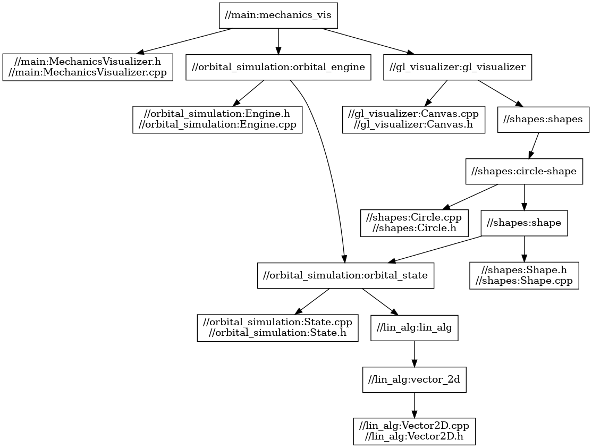

# Oribital Mechanics Visualizer

The goal of this project is to create a reactive orbital mechanics visualizer that manipulates state variables (in some fashion) of orbital bodies in response to changes in input music. 

This project also will control a lazer array.

## Software Architecture:
